# 1. Inženýrství požadavků

## 1.1 Diagram případů užití (Use Case)
Tento diagram definuje interakce mezi jednotlivými rolemi uživatelů a systémem pro správu elektromobilů.

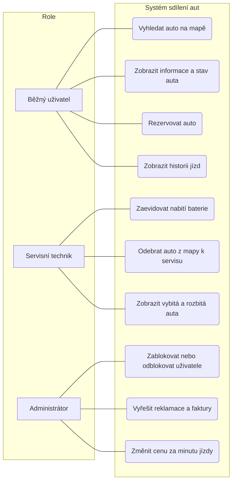

## 1.2 Diagramy aktivit
Níže jsou rozkresleny jednotlivé případy užití krok za krokem z pohledu jednotlivých rolí v systému.

### Role: Běžný uživatel

**UC Běžného uživatele 1: Vyhledat auto na mapě**
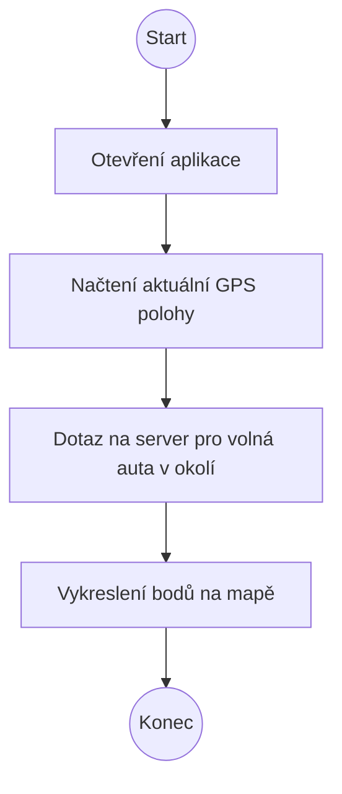

**UC Běžného uživatele 1.1: Zobrazit informace a stav auta**
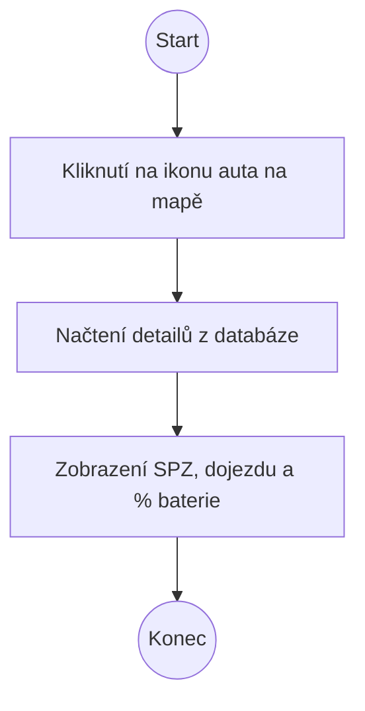

**UC Běžného uživatele 2: Rezervovat auto**
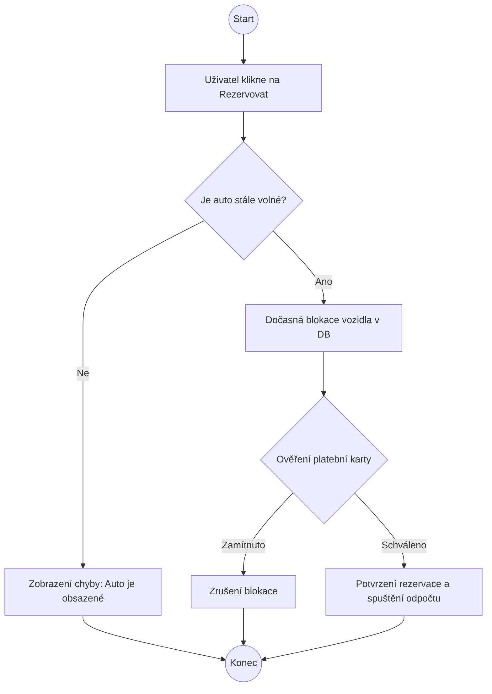

**UC Běžného uživatele 3: Zobrazit historii jízd**
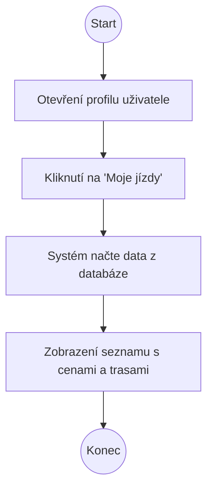

### Role: Servisní technik

**UC Servisního technika 1: Zaevidovat nabití baterie**
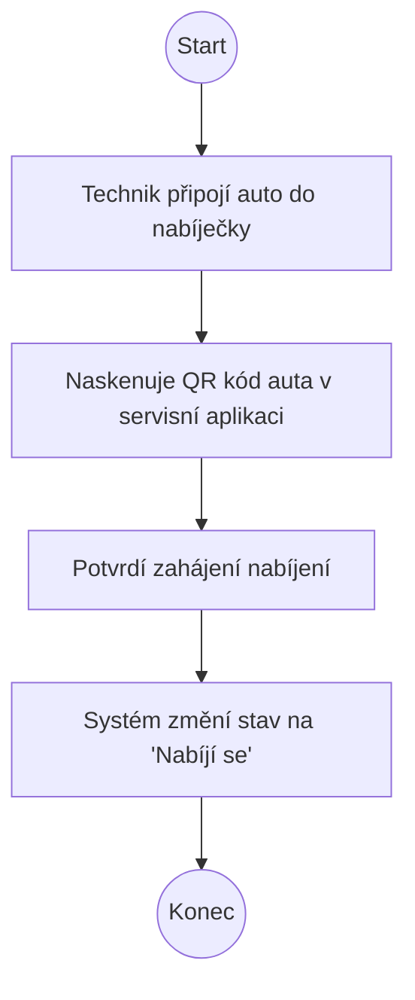

**UC Servisního technika 2: Odebrat auto z mapy k servisu**
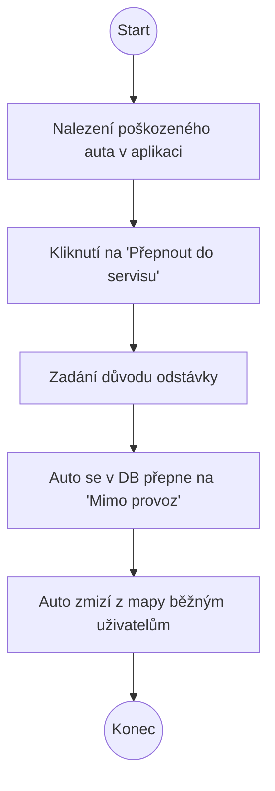

**UC Servisního technika 3: Zobrazit vybitá a rozbitá auta**
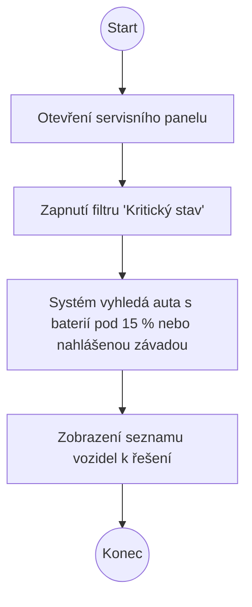

### Role: Administrátor

**UC Administrátora 1: Zablokovat nebo odblokovat uživatele**
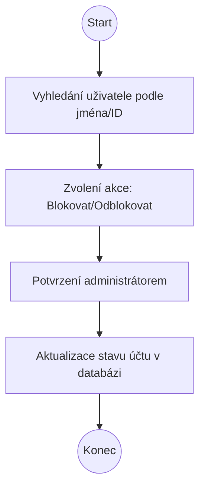

**UC Administrátora 2: Vyřešit reklamace a faktury**
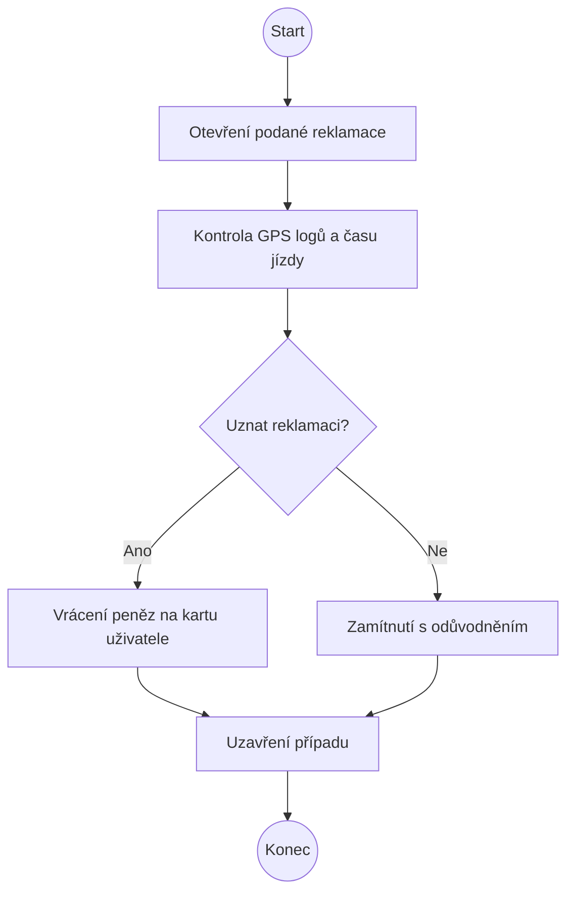

**UC Administrátora 3: Změnit cenu za minutu jízdy**
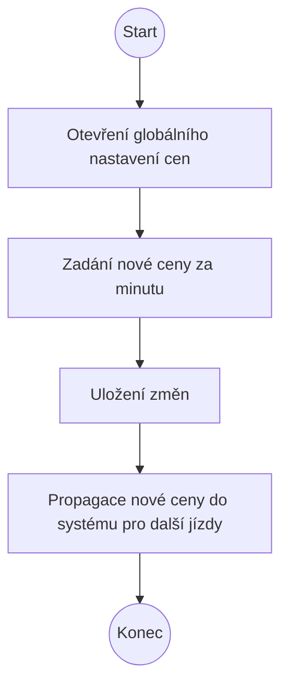

### 1.3 Zdroje požadavků (Stakeholders)
Zde je popis našich zdrojů, které definují hodnotu jednotlivých požadavků v systému:
* **Zákazník:** Koncový řidič elektromobilu. Vyžaduje spolehlivost a rychlost klíčových funkcí (rezervace, odemčení).
* **Business:** Vedení firmy financující projekt. Definuje požadavky zajišťující ziskovost a stabilitu (fakturace, dostupnost).
* **Technik / Provoz:** Interní tým zajišťující správu vozového parku. Technik se stará o fyzickou údržbu aut v terénu a servisu, zatímco provoz (dispečink) celkově sleduje a mění stavy vozidel podle potřeby. Z tohoto důvodu role vyžaduje přístup k telemetrickým datům (stav baterie) a možnost ovládat servisní režim.
* **Architekt:** Hlavní softwarový návrhář. Definuje interní technické a mimofunkční požadavky (šifrování, robustnost).
* **Legislativa:** Právní rámec a státní nařízení. Diktuje povinné shody s předpisy (GDPR).
* **UX (User Experience):** Návrhář uživatelského rozhraní. Zaměřuje se na přívětivost systému (vizualizace na mapě).
* **Administrátor**: Správce celého systému. Vyžaduje nástroje pro bezpečné řízení přístupů uživatelů, řešení sporů a celkovou kontrolu nad platformou.

## 1.4 Specifikace funkčních požadavků

| ID | Požadavek | Popis | Priorita | Zdroj | Rizika | Závislosti |
|:---|:---|:---|:---:|:---|:---|:---|
| **F01** | Rezervace vozidla | Uživatel si může zablokovat auto pro sebe skrze aplikaci. | High | Zákazník | Race condition (duplicitní rezervace) | F02 |
| **F02** | Sledování stavu | Systém eviduje stavy: volné, rezervované, v servisu. | High | Provoz | Nekoherentní data v databázi | - |
| **F03** | Správa uživatelů | Administrátor může měnit role a oprávnění uživatelů. | Medium | Administrátor | Neoprávněné zvýšení privilegií | - |
| **F04** | Integrace map | Zobrazení polohy a dostupnosti aut na mapovém podkladu. | Medium | UX | Výpadek externí mapové služby (API) | F02 |
| **F05** | Fakturace jízdy | Automatický výpočet ceny a vystavení faktury po jízdě. | High | Business | Chyba ve výpočtu času/vzdálenosti | F06 |
| **F06** | Historie jízd | Uživatel má přístup k seznamu svých minulých výpůjček. | Low | Zákazník | Únik citlivých osobních údajů | - |
| **F07** | Stav baterie | Systém v reálném čase monitoruje a zobrazuje % nabití. | High | Technik | Zpoždění telemetrických dat z vozidla | - |
| **F08** | Ukončení jízdy | Bezpečné ukončení pronájmu a uzamčení vozidla. | High | Zákazník | Auto zůstane fyzicky odemčené | F01 |
| **F09** | Blokace neplatičů | Automatické zamezení rezervace při neuhrazených dluzích. | Medium | Business | Chybná blokace platícího zákazníka | F05 |
| **F10** | Servisní režim | Možnost technika vyřadit vozidlo z nabídky pro veřejnost. | Medium | Technik | Nechtěné vyřazení funkčního vozu | F02 |

## 1.5 Specifikace mimofunkčních požadavků

| ID | Požadavek | Popis | Priorita | Zdroj | Rizika | Závislosti |
|:---|:---|:---|:---:|:---|:---|:---|
| **N01** | Bezpečná komunikace | Komunikace mezi aplikací a serverem probíhá výhradně přes šifrovaný protokol TLS. | High | Architekt | Odposlech citlivých dat (Man-in-the-middle) | - |
| **N02** | Dostupnost systému | Systém musí být dostupný v režimu 24/7 s garantovanou dostupností 99,9 % času. | Medium | Business | Ušlý zisk a nespokojenost lidí při výpadku | - |
| **N03** | Robustnost a zálohy | Odolnost proti HW chybám, při výpadku primárního serveru plynule přebírají provoz záložní servery. | Medium | Architekt | Krátkodobý výpadek při přepínání uzlů | - |
| **N04** | Ochrana osobních dat | Soulad s GDPR, citlivá data (hesla, platební údaje) jsou v DB šifrována. | High | Legislativa | Únik osobních údajů a právní postihy / pokuty | F03 |
| **N05** | Auditní logování | Veškeré změny stavů vozidla (rezervace, servis) jsou logovány s vazbou na ID uživatele. | Low | Provoz | Rychlé zaplnění diskového prostoru logy | F01, F10 |

## 1.6 Konfliktní požadavky a nejasnosti během analýzy

**1. Konflikt: Zobrazení historie jízd (F06) a Auditní logování  (N05) vs. Ochrana osobních dat / GDPR (N04)**
* **Identifikovaná nejasnost:** Systém musí pro uživatele a administrátory zaznamenávat přesnou trasu jízdy kvůli reklamacím. Dlouhodobé uchovávání přesných GPS bodů pohybu konkrétní osoby je však z hlediska ochrany soukromí a legislativy GDPR nepřípustné. Auditní logování má stejný problém.
* **Navržené řešení F06:** Systém bude uchovávat detailní GPS trasu na mapě pouze po dobu 30 dnů od ukončení jízdy (kvůli vyřešení případných reklamací v rámci administrátorského bodu UC8). Poté se detailní souřadnice z databáze automaticky a nevratně smažou. V historii uživatele (F06) zůstane pouze agregovaný záznam: Datum, celkový čas, start, cíl, ujetá vzdálenost a výsledná cen. 
* **Navržené řešení N05:** Auditní logy využijí princip maskování a minimalizace dat. Místo plných osobních údajů se budou ukládat pouze částečné identifikátory (např. systémové ID nebo poslední 4 číslice karty). To umožní zpětné řešení technických problémů a podvodů bez zbytečného hromadění citlivých informací.
  
**2. Konflikt: Správa rolí/Zvýšení privilegií (F03) vs. Bezpečnost a GDPR (N04)**
* **Identifikovaná nejasnost:** Existence administrátorské role s právem měnit oprávnění (F03) vytváří obrovské bezpečnostní riziko. Pokud by útočník zneužil systém pro neoprávněné zvýšení svých privilegií, získal by plný přístup k citlivým osobním údajům zákazníků, což by vedlo k okamžitému porušení GDPR (N04).
* **Navržené řešení:** Změna rolí a povyšování uživatelů na administrátory nebude možná běžným uživatelem a bude logována.

# 2. Softwarová architektura

## 2.1 Volba architektury a její zdůvodnění

Pro návrh systému správy sdílených elektromobilů jsem zvolila **Vrstvenou architekturu (Layered Architecture)**.

**Zdůvodnění volby:**
1. **Jasné rozdělení úkolů a snadná údržba:** Aplikace je logicky rozdělena na tři části: API (prezentační vrstva), byznys logiku (jádro) a datovou vrstvu. Praxe ukazuje, že toto striktní rozdělení zodpovědností (Separation of Concerns) výrazně zrychluje implementaci nových funkcí a usnadňuje údržbu kódu. Zároveň mi to umožňuje testovat hlavní logiku odděleně pomocí testovacích dvojníků (Fake databáze v paměti).
2. **Přiměřenost k zadání (Oproti mikroslužbám):** Jak uvádějí oborová srovnání architektonických vzorů, která jsem četla, jsou mikroslužby ideální pro masivní a vysoce komplexní systémy a přinášejí výhody velkým týmům. U menších projektů však znamenají zbytečnou práci a komplexnost navíc. Vrstvená architektura naopak nabízí zjednodušené nasazení (deployment) a údržbu, což naprosto přesně odpovídá rozsahu této práce. Nemusím tak řešit složitou síťovou komunikaci a problémy s konzistencí dat napříč službami.
3. **Flexibilita do budoucna:** Vrstvený přístup funguje jako začátek pro projekt tohoto měřítka. Pokud by v budoucnu systém čelil extrémní zátěži a narazil na limity, díky čistému rozhraní mezi vrstvami lze jednotlivé moduly postupně vyčlenit a změnit do mikroslužeb. Není tak nutné zahodit celý projekt a psát jej od začátku.

## 2.2 Diagram komponent a interakcí
Následující diagram znázorňuje hlavní komponenty systému a toky dat mezi nimi. Zahrnuje komunikaci od uživatelského rozhraní přes API až po databázi a externí služby.
(V mé minimální implementaci jsem sloučila do rezervační služby i přímo tu službu správy vozidel, aby vše bylo v jedné komponentně. Správně by to ale měla být vlastní komponenta.)
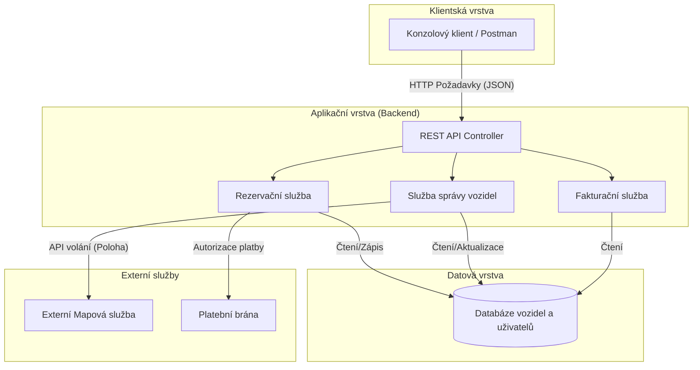

## 2.3 Popis klíčových komponent


* **REST API Controller:** Vstupní brána do systému. Přijímá HTTP požadavky od klientů, provádí základní validaci vstupů a směruje je dál na příslušné služby.
* **Rezervační služba:** Obsahuje hlavní logiku pro vytváření, ověřování a rušení rezervací. Hlídá byznys pravidla a řeší kolize, aby si dva lidé nemohli zarezervovat stejné auto ve stejný moment.
* **Služba správy vozidel:** Eviduje a mění stavy aut (volné, rezervované, v servisu). Komunikuje s mapovou službou pro získání a aktualizaci GPS souřadnic vozidel.
* **Fakturační služba:** Po úspěšném ukončení jízdy vypočítá výslednou cenu na základě času jízdy a ujeté vzdálenosti.
* **Databáze:** Data jsou uložena přímo v paměti programu pomocí Python slovníku (`db_cars`). Tento slovník v mém kódu simuluje datové úložiště vozidel a jejich stavů. V testování toto řešení funguje jako testovací dvojník typu **Fake**. V ostré produkci by se tento slovník nahradil klasickou databází (např. PostgreSQL).

# 3. Vývoj komponent a API

Pro implementaci klíčové komponenty byl zvolen jazyk Python a webový framework FastAPI. Vybranou komponentou je **Rezervační služba (ReservationService)**, která ověřuje dostupnost vozidel a mění jejich stavy.

## 3.1 Komunikace komponent
Protože se jedná o minimální implementaci bez reálné databáze a externích služeb, je komunikace mezi komponentami simulována výpisem do konzole. Komponenta tak v reálném čase reportuje akce prováděné v okolních subsystémech.

**Příklad výstupu v konzoli při úspěšné rezervaci:**
```text
[START] Rezervace auta 1 pro uživatele 42
[LOG - Platební brána] Autorizace platby...
[LOG - Databáze] SUCCESS: Auto 1 rezervováno.
```

# 4. Webové služby

Nad vytvořenou komponentou bylo vystaveno REST API pro komunikaci s frontendem.

## 4.1 Seznam endpointů
* `GET /cars` - Vrací aktuální stav všech aut v databázi (pro vykreslení do mapy).
* `POST /reserve` - Přijímá JSON s ID uživatele a ID vozidla a vytváří rezervaci.

## 4.2 Ukázka volání API pomocí nástroje cURL

**0. List informací o všech autech v databázi:**
```bash
curl -X GET "http://127.0.0.1:8000/cars" -H "accept: application/json"
```
Výsledek: {"1":{"id":1,"model":"Škoda Enyaq","status":"volné","battery":85},"2":{"id":2,"model":"Tesla Model 3","status":"v servisu","battery":15},"3":{"id":3,"model":"Hyundai Ioniq 5","status":"rezervováno","battery":60}}

**1. Rezervace:**
```bash
curl -X POST "http://127.0.0.1:8000/reserve" -H "accept: application/json" -H "Content-Type: application/json" -d "{\"user_id\": 42, \"car_id\": 1}"
```
Výsledek: {"status":"ok","message":"Rezervace vytvořena","car":{"id":1,"model":"Škoda Enyaq","status":"rezervováno","battery":85}}

**2. Odeslání auta do servisu:**
```bash
curl -X POST "http://127.0.0.1:8000/service/1?reason=Defekt" -H "accept: application/json"
```
Výsledek: {"status":"ok","message":"Auto 1 bylo vyřazeno z oběhu a nahlášeno servisu.","details":{"id":1,"model":"Škoda Enyaq","status":"v servisu","battery":85}}

**3. Uvolnění auta ze servisu:**
```bash
curl -X POST "http://127.0.0.1:8000/release?car_id=1" -H "accept: application/json"
```
Výsledek: {"status":"ok","message":"Vozidlo bylo úspěšně uvolněno (původní stav: volné)","car":{"id":1,"model":"Škoda Enyaq","status":"volné","battery":85}}

**4. Neúspěšná rezervace (auto v servisu):**
Očekávaný výsledek: Chybová hláška vozidlo není k dispozici
```bash
curl -X POST "http://127.0.0.1:8000/reserve" -H "accept: application/json" -H "Content-Type: application/json" -d "{\"user_id\": 99, \"car_id\": 2}"
```
Výsledek: {"detail":"Vozidlo není k dispozici."}


**5. Neúspěšné odeslání auta do servisu (neexistující auto):**
Očekávaný výsledek: Chybová hláška vozidlo nenalezeno
```bash
curl -X POST "http://127.0.0.1:8000/service/1?reason=Defekt" -H "accept: application/json"
```
Výsledek: {"detail":"Vozidlo nenalezeno."}

**6. Neúspěšné uvolnění auta ze servisu (neexistující auto):**
Očekávaný výsledek: Chybová hláška vozidlo nenalezeno
```bash
curl -X POST "http://127.0.0.1:8000/release?car_id=999" -H "accept: application/json"
```
Výsledek: {"detail":"Vozidlo nenalezeno."}


# 5. Testování softwaru

## 5.1 Implementované testy
Pro vytvořenou komponentu a API bylo napsáno 5 testů pomocí frameworku `pytest`. Testy pokrývají jak happy-path (úspěšná rezervace), tak chybové stavy (rezervace obsazeného nebo neexistujícího vozidla). Zdrojový kód testů je součástí odevzdaného repozitáře v souboru `test_main.py`.

**Výstup z úspěšného spuštění testů:**
### Výsledek testování komponenty ReservationService

```text
============================= test session starts =============================
platform win32 -- Python 3.13.0, pytest-9.0.2, pluggy-1.6.0
rootdir: C:\Users\Admin\Desktop\Schule\KSWI-main
plugins: anyio-4.13.0
collected 5 items          

test_main.py::test_reserve_available_car_success PASSED          [ 20%]
test_main.py::test_release_car_to_available PASSED               [ 40%]
test_main.py::test_send_to_service_and_fix_it PASSED             [ 60%]
test_main.py::test_reserve_nonexistent_car_fails PASSED          [ 80%]
test_main.py::test_release_nonexistent_car_fails PASSED          [100%]

============================== 5 passed in 0.04s ============================== 
```

## 5.2 Plán testování celého systému

Pro zajištění kvality (QA) celého produkčního systému je navržen následující plán:

### Metody návrhu testů (Test Design Techniques)
Při návrhu testovacích případů kombinujeme dvě základní metodiky testování:
* **Whitebox testing (Testování černé skříňky zevnitř):** Technika, při které tester/vývojář zná vnitřní strukturu, logiku a zdrojový kód aplikace. Testy se navrhují tak, aby prošly všechny podmínky, cykly a větve v kódu. Typicky se využívá u jednotkových testů.
* **Blackbox testing (Testování černé skříňky):** Technika, kdy se na systém nahlíží jako na uzavřenou schránku bez znalosti vnitřního kódu. Testuje se čistě funkčnost systému na základě definovaných vstupů a očekávaných výstupů přes uživatelské rozhraní nebo API. Typicky se využívá u E2E a akceptačních testů.

### Typy testů

#### 1. FUNCTIONAL TESTING (Funkční testování)
Zaměřuje se na to, **co** ten systém dělá a zda správně plní zadané požadavky.

* **Unit tests (Jednotkové testy):** Testují izolované funkce (např. matematický výpočet ceny za jízdu nebo test na sčítání) pomocí metody **Whitebox**.
* **Integration tests (Integrační testy):** Ověřují vzájemnou komunikaci mezi komponentami (např. propojení funkce a databáze nebo API a platební brány). V této fázi se často používají testovací dvojníci (test doubles) – v naší implementaci je to slovník `db_cars` v paměti fungující jako **Fake**.
* **End to end tests (E2E / Systémový test):** Simuluje průchod celým systémem z pohledu uživatele pomocí metody **Blackbox**. Testuje se kompletní scénář, například zda lze vybrat auto, provést rezervaci a zkusit, zda vše funguje od začátku do konce (obdoba vložení věci do nákupního košíku v e-shopech).
* **Alpha / Beta / Acceptance test (Akceptační testování):** Závěrečný test, kdy zákazník testuje software. Pokud ho potvrdí, software je nasazen (deploynutý). Má tyto fáze:
    * **Alpha test:** Testování, jak systém běží interně na firemním hardwaru (HW).
    * **Beta test:** Testování koncovými uživateli přímo na jejich vlastním (user) HW.

#### 2. NON-FUNCTIONAL TESTING (Mimo-funkční testy)
Zaměřuje se na to, **jak** ty funkce systém vykonává (vlastnosti jako výkon, stabilita a bezpečnost).

* **Load / Stress / Endurance testing:** Testování zátěže na systém a celkového výkonu:
    * *Load test:* Testování při standardním, očekávaném zatížení.
    * *Stress test:* Krátkodobé vystavení systému extrémní, maximální zátěži (short term).
    * *Endurance test:* Dlouhodobé testování systému pod vysokou zátěží (long term).
* **Scalability test (Testování škálovatelnosti):** Ověřuje, jak je systém schopen růst a zvládat navyšování kapacity hardwaru nebo počtu uživatelů.
* **Pen testy (Penetrační testování):** Simulované kybernetické útoky, které testují zabezpečení systému a hledají potenciální zranitelnosti.
  

### Testovací dvojníci (Test Doubles)
V plánu testování využíváme tyto typy testovacích dvojníků pro izolaci komponent:

* **Test Dummy:** Prázdný objekt předávaný výhradně jako parametr funkce (jako figurína při crash testech). Neobsahuje žádná reálná data a slouží jen k úspěšnému vyvolání funkce.
* **Test Stub:** Náhrada, která vrací natvrdo zadané (hard-coded) statické hodnoty. Používá se k podstrčení fixních dat (např. pevná cena za minutu), aby test nezávisel na externích službách.
* **Test Fake:** Funkční náhrada systému s jednodušší implementací, která není vhodná pro ostrý provoz. V mém projektu je to slovník `db_cars` simulující databázi v paměti.
* **Test Mock:** Dvojník s předem definovaným chováním. Používá se ke zjednodušení procesů, například pro okamžité vracení platného autorizačního tokenu bez nutnosti reálného přihlašování.
* **Test Spy:** Dvojník podobný Stubu, který navíc aktivně monitoruje a zaznamenává informace o tom, jak s ním systém komunikoval (např. počítá množství zavolání).

### Strategie a kvalita kódu

* **Shift-left přístup:** Strategie, kdy se testování a kontrola kvality posouvají na úplný začátek vývojového cyklu. Testování tak nezačíná až u hotového kódu, ale již ve fázi analýzy a návrhu zadání. Hlavní technikou tohoto přístupu je:
    * **Validace (Kontrola kvality požadavků):** Před samotným kódováním se požadavky kontrolují podle 5 základních kritérií, aby se předešlo drahým chybám v implementaci:
        1. *Validita (Správnost):* Ověřuje se, zda je požadavek opravdu zapotřebí a zda jeho roli už neplní jiná existující funkce.
        2. *Konzistence (Bezrozpornost):* Kontroluje se, zda je požadavek ve shodě s ostatními a zda nejdou proti sobě.
        3. *Úplnost:* Ověřuje se, zda požadavek obsahuje všechny informace, které vývojáři potřebují k implementaci.
        4. *Realismus (Realizovatelnost):* Zkoumá se, zda je požadavek technicky, finančně a časově realizovatelný.
        5. *Ověřitelnost:* Požadavek musí být měřitelný (obsahovat konkrétní čas nebo hodnotu), aby se dalo exaktně ověřit jeho splnění.

* **TDD (Test Driven Development):** Vývojová praxe, při které programátoři píší automatizované testy dříve než samotný produkční kód, což je vede k čistšímu návrhu a okamžitému odhalení chyb. Podporuje to myšlenku včasného odhalování defektů.

* **BDD (Behavior-Driven Development):** Rozšíření metodiky TDD, které se zaměřuje na chování systému z pohledu uživatele. Scénáře se píší v lidsky čitelném jazyce (často pomocí šablony *Given-When-Then* / *Pokud-Když-Pak*). To umožňuje, aby na kvalitu a správnost požadavků dohlíželi společně vývojáři, testeři i byznys analytici ještě před začátkem vývoje.

* **Statická analýza kódu:** Nasazení nástrojů (např. SonarQube) pro automatickou kontrolu zranitelností, bezpečnostních chyb a dodržování jednotné štábní kultury kódu bez nutnosti jeho spuštění.

* **CI/CD datovod (Pipeline):** Každý commit do větve `main` v Gitu automaticky spustí build aplikace, linter (statickou analýzu) a všechny testy. Pokud jakýkoliv test nebo kontrola kvality selže, nasazení na produkční servery se automaticky zablokuje.

---


# 6. Evoluce softwaru

Systém je navržen tak, aby umožňoval budoucí rozšiřování. Pro další iteraci vývoje (v2.0) jsou navrženy následující tři změny:

### 1. Integrace s MHD (Městská hromadná doprava)
* **Popis:** Uživatel si bude moci zakoupit kombinovaný lístek, který mu umožní dojet tramvají či autobusem k nejbližšímu volnému elektromobilu.
* **Dopad na architekturu a kód:** Bude nutné přidat novou komponentu `TransitIntegrationService`, která bude přes externí API komunikovat s dopravním podnikem. V databázi přibude nová entita `KombinovanaRezervace`. Logika naší komponenty `ReservationService` se bude muset rozšířit o schopnost rezervovat vozidlo s odloženým startem (po dobu, než uživatel k autu dojede hromadnou dopravou).

### 2. Dynamická cenotvorba (Surge Pricing)
* **Popis:** V době dopravní špičky nebo nepříznivého počasí (deště) se cena za minutu jízdy automaticky zvýší. Pokud má auto nízký stav baterie a uživatel ho po ukončení jízdy zapojí do nabíječky, dostane naopak slevu.
* **Dopad na architekturu a kód:** Tato změna neovlivní samotnou architekturu (vrstvy zůstanou stejné), ale výrazně zasáhne do vnitřního kódu `BillingService` (Fakturační služby) a `ReservationService`. V `ReservationService` se bude muset při vytvoření rezervace zafixovat aktuálně vypočítaná cena, aby se během jízdy už neměnila.

### 3. Zavedení firemních účtů (B2B Fleet)
* **Popis:** Identifikace nového typu uživatele: Firemní manažer. Tento uživatel může rezervovat auta pro své zaměstnance a platby se strhávají ze sdíleného firemního účtu.
* **Dopad na architekturu a kód:** Bude nutné masivně upravit datové modely. Do databázové tabulky uživatelů přibude vazba na `CompanyAccount`. Změní se autentizační a autorizační API a v uživatelském rozhraní (UI) přibude zcela nový dashboard pro správu firemních účtů. Komponenta `ReservationService` bude muset před schválením rezervace ověřit nejen platnost uživatele, ale také zda má jeho firma na svém účtu dostatečný kredit.

