# 1. Inženýrství požadavků

## 1.1 Diagram případů užití (Use Case)
Tento diagram definuje interakce mezi jednotlivými rolemi uživatelů a systémem pro správu elektromobilů.

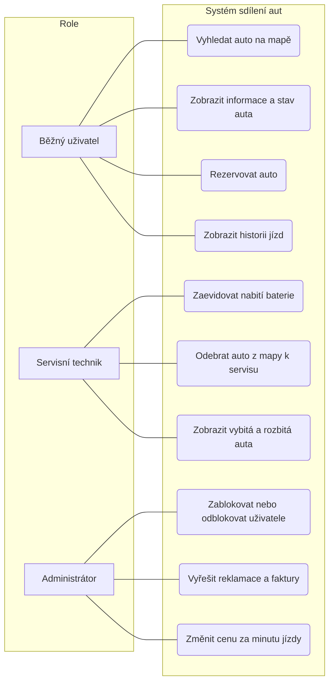

## 1.2 Diagramy aktivit
Níže jsou rozkresleny jednotlivé případy užití krok za krokem z pohledu jednotlivých rolí v systému.

### Role: Běžný uživatel

**UC1: Vyhledat auto na mapě**
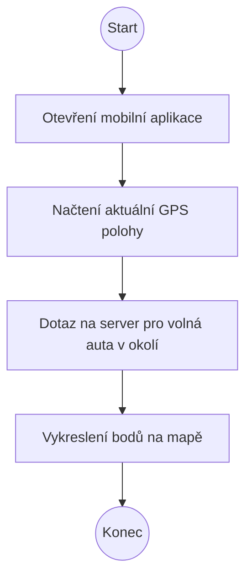

**UC1b: Zobrazit informace a stav auta**
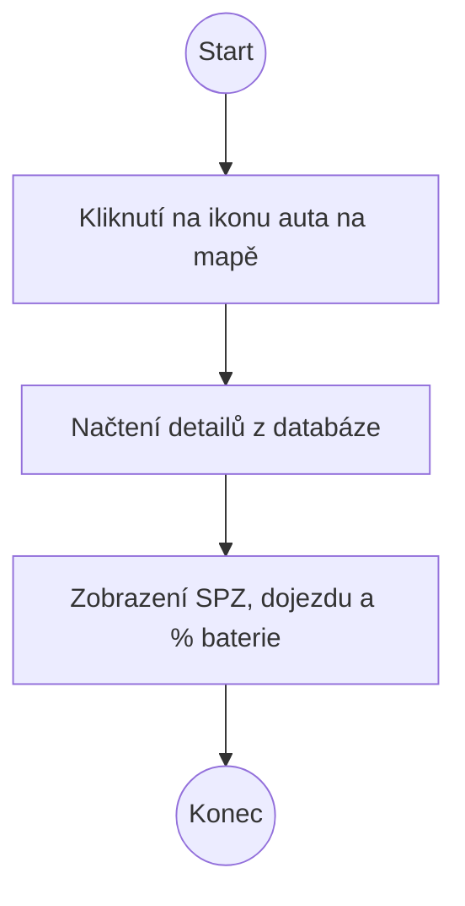

**UC2: Rezervovat auto**
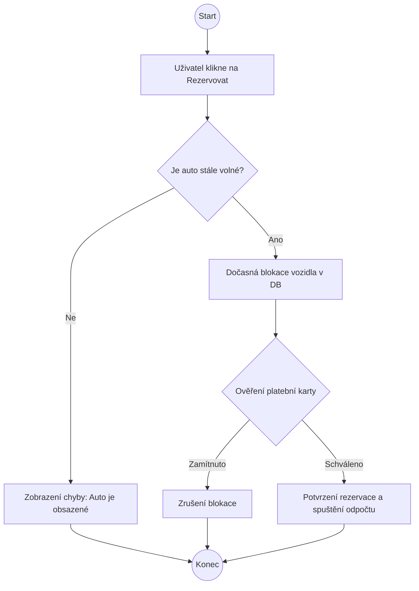

**UC3: Zobrazit historii jízd**
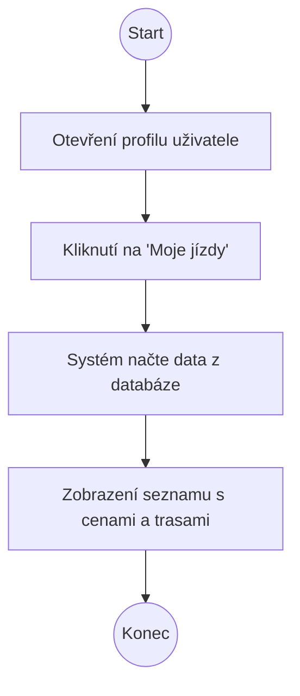

### Role: Servisní technik

**UC4: Zaevidovat nabití baterie**
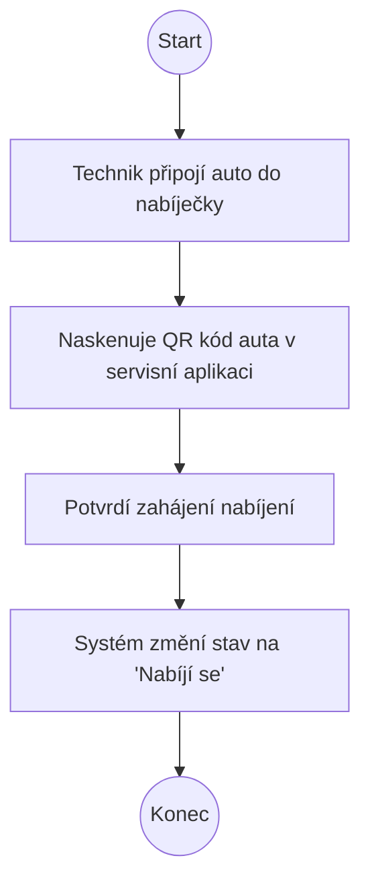

**UC5: Odebrat auto z mapy k servisu**
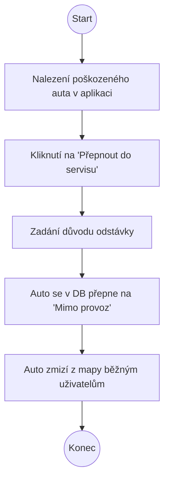

**UC6: Zobrazit vybitá a rozbitá auta**
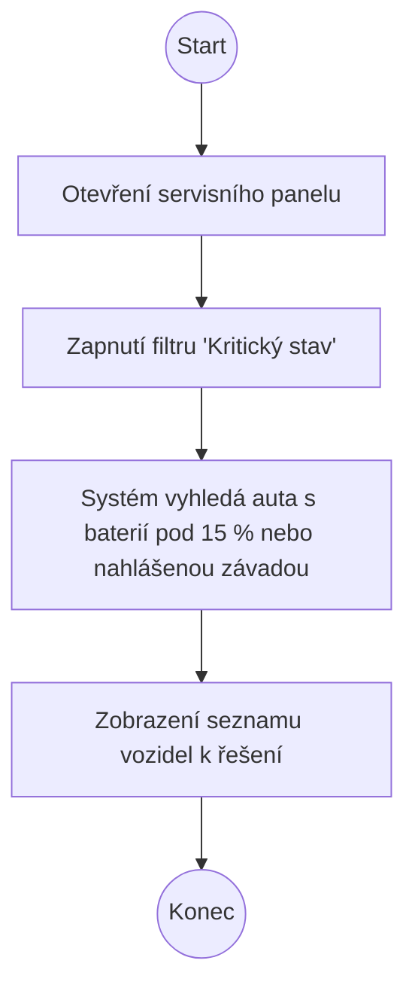

### Role: Administrátor

**UC7: Zablokovat nebo odblokovat uživatele**
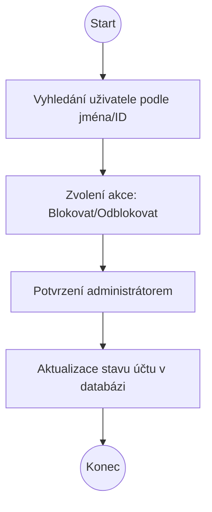

**UC8: Vyřešit reklamace a faktury**
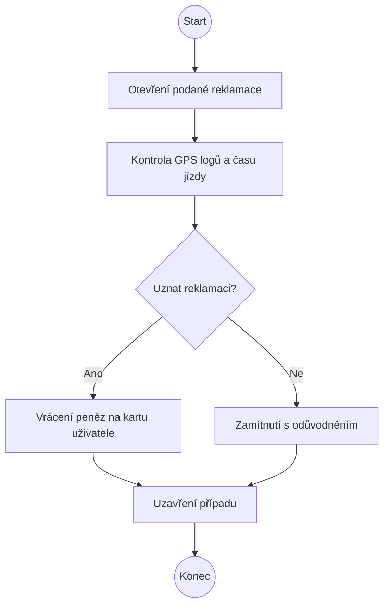

**UC9: Změnit cenu za minutu jízdy**
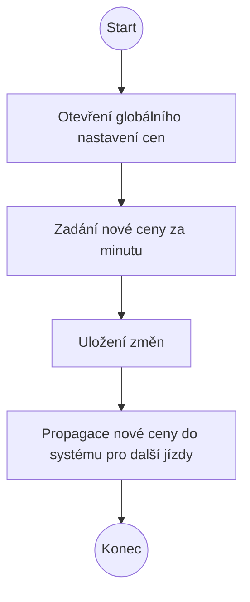

## 1.3 Specifikace funkčních požadavků

| ID | Požadavek | Popis | Priorita | Zdroj | Rizika | Závislosti |
|:---|:---|:---|:---:|:---|:---|:---|
| **F01** | Rezervace vozidla | Uživatel si může zablokovat auto pro sebe skrze aplikaci. | High | Zákazník | Race condition (duplicitní rezervace) | F02 |
| **F02** | Sledování stavu | Systém eviduje stavy: volné, rezervované, v servisu. | High | Provoz | Nekoherentní data v databázi | - |
| **F03** | Správa uživatelů | Administrátor může měnit role a oprávnění uživatelů. | Medium | Zadání | Neoprávněné zvýšení privilegií | - |
| **F04** | Integrace map | Zobrazení polohy a dostupnosti aut na mapovém podkladu. | Medium | UX | Výpadek externí mapové služby (API) | F02 |
| **F05** | Fakturace jízdy | Automatický výpočet ceny a vystavení faktury po jízdě. | High | Business | Chyba ve výpočtu času/vzdálenosti | F06 |
| **F06** | Historie jízd | Uživatel má přístup k seznamu svých minulých výpůjček. | Low | Zákazník | Únik citlivých osobních údajů | - |
| **F07** | Stav baterie | Systém v reálném čase monitoruje a zobrazuje % nabití. | High | Technik | Zpoždění telemetrických dat z vozidla | - |
| **F08** | Ukončení jízdy | Bezpečné ukončení pronájmu a uzamčení vozidla. | High | Zákazník | Auto zůstane fyzicky odemčené | F01 |
| **F09** | Blokace neplatičů | Automatické zamezení rezervace při neuhrazených dluzích. | Medium | Fakturace | Chybná blokace platícího zákazníka | F05 |
| **F10** | Servisní režim | Možnost technika vyřadit vozidlo z nabídky pro veřejnost. | Medium | Technik | Nechtěné vyřazení funkčního vozu | F02 |

## 1.4 Mimofunkční požadavky

1. **Bezpečnost (N01):** Komunikace mezi aplikací klienta a serverem probíhá výhradně přes šifrovaný protokol TLS (Transport Layer Security). (Priorita: High)
2. **Dostupnost (N02):** Systém musí být pro uživatele dostupný v režimu 24/7 s garantovanou dostupností 99,9 % času (minimalizace neplánovaných výpadků). (Priorita: Medium)
3. **Robustnost (N03):** Systém je odolný proti hardwarovým chybám a plánované údržbě, při lokálním výpadku primárního serveru plynule přebírají provoz záložní (backup) servery. (Priorita: Medium)
4. **Ochrana dat (N04):** Systém plně splňuje požadavky GDPR; citlivá osobní data (např. hesla, platební údaje) jsou v databázi šifrována pomocí standardu SHA-256. (Priorita: High)
5. **Logování (N05):** Veškeré změny stavů vozidla (např. rezervace, servisní odstávka) jsou logovány/uložené s přímou vazbou na ID uživatele. (Priorita: Low)

## 1.5 Konfliktní požadavky a nejasnosti během analýzy

**Identifikovaná nejasnost:**
Během analýzy byl zjištěn konflikt mezi požadavkem na **Zobrazení historie jízd (F06)** a striktní **Ochranou dat podle GDPR (N04)**. Systém musí na jednu stranu zaznamenávat trasu, ale dlouhodobé uchovávání přesných GPS bodů pohybu konkrétní osoby je z hlediska ochrany soukromí problematické.

**Navržené řešení:**
Systém bude uchovávat detailní GPS trasu na mapě pouze po dobu 30 dnů od ukončení jízdy (kvůli bodu UC8 - Vyřešení případných reklamací). Poté se detailní souřadnice z databáze automaticky nevratně smažou a v historii uživatele (F06) zůstane pouze agregovaný záznam: Datum, celkový čas, start, cíl, ujetá vzdálenost a cena.
