# 1. Inženýrství požadavků

## 1.1 Diagram případů užití (Use Case)
Tento diagram definuje interakce mezi jednotlivými rolemi uživatelů a systémem pro správu elektromobilů.

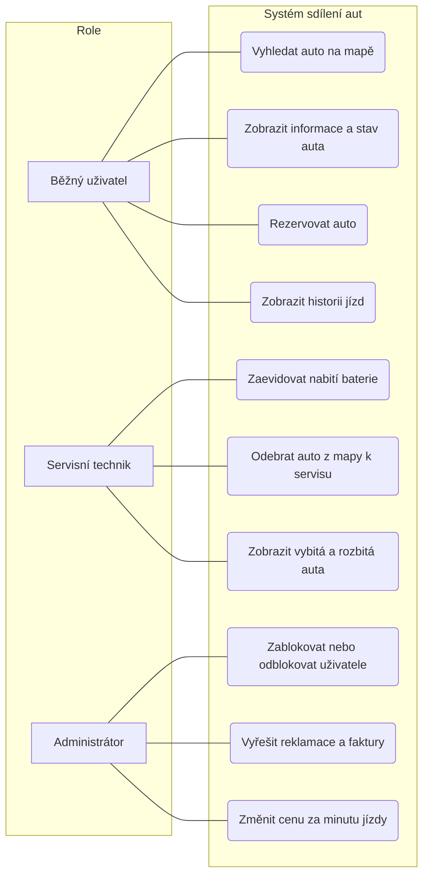
```mermaid
graph LR
    subgraph Role
        U[Běžný uživatel]
        T[Servisní technik]
        A[Administrátor]
    end

    subgraph "Systém sdílení aut"
        U --- UC1(Vyhledat auto na mapě)
        U --- UC1b(Zobrazit informace a stav auta)
        U --- UC2(Rezervovat auto)
        U --- UC3(Zobrazit historii jízd)

        T --- UC4(Zaevidovat nabití baterie)
        T --- UC5(Odebrat auto z mapy k servisu)
        T --- UC6(Zobrazit vybitá a rozbitá auta)

        A --- UC7(Zablokovat nebo odblokovat uživatele)
        A --- UC8(Vyřešit reklamace a faktury)
        A --- UC9(Změnit cenu za minutu jízdy)
    end
```

## 1.2 Diagramy aktivit
Níže jsou rozkresleny jednotlivé případy užití krok za krokem z pohledu jednotlivých rolí v systému.

### Role: Běžný uživatel

**UC Bežného uživatele 1: Vyhledat auto na mapě**
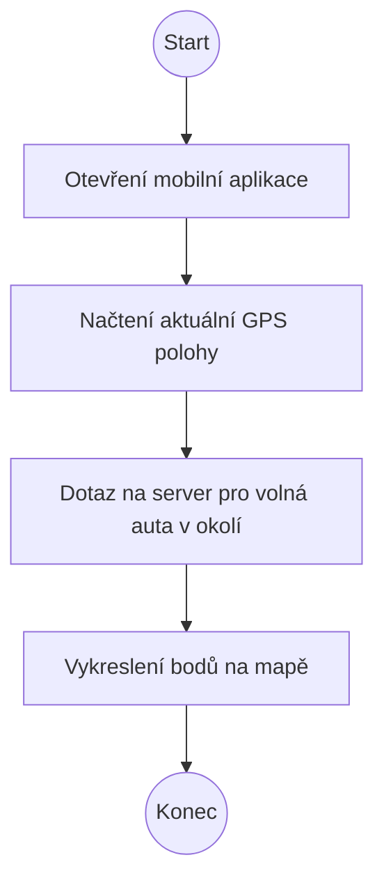
```mermaid
flowchart TD
    Start((Start)) --> Open[Otevření mobilní aplikace]
    Open --> GPS[Načtení aktuální GPS polohy]
    GPS --> Fetch[Dotaz na server pro volná auta v okolí]
    Fetch --> Display[Vykreslení bodů na mapě]
    Display --> End((Konec))
```

**UC Bežného uživatele 1.1: Zobrazit informace a stav auta**
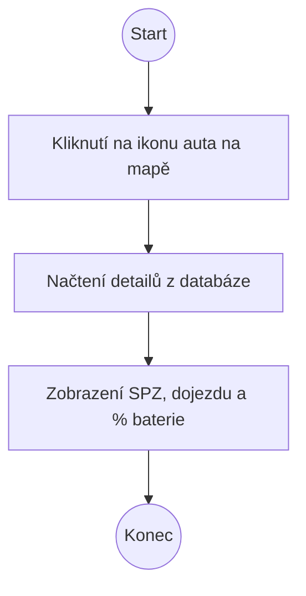
```mermaid
flowchart TD
    Start((Start)) --> Click[Kliknutí na ikonu auta na mapě]
    Click --> FetchData[Načtení detailů z databáze]
    FetchData --> Show[Zobrazení SPZ, dojezdu a % baterie]
    Show --> End((Konec))
```

**UC Bežného uživatele 2: Rezervovat auto**
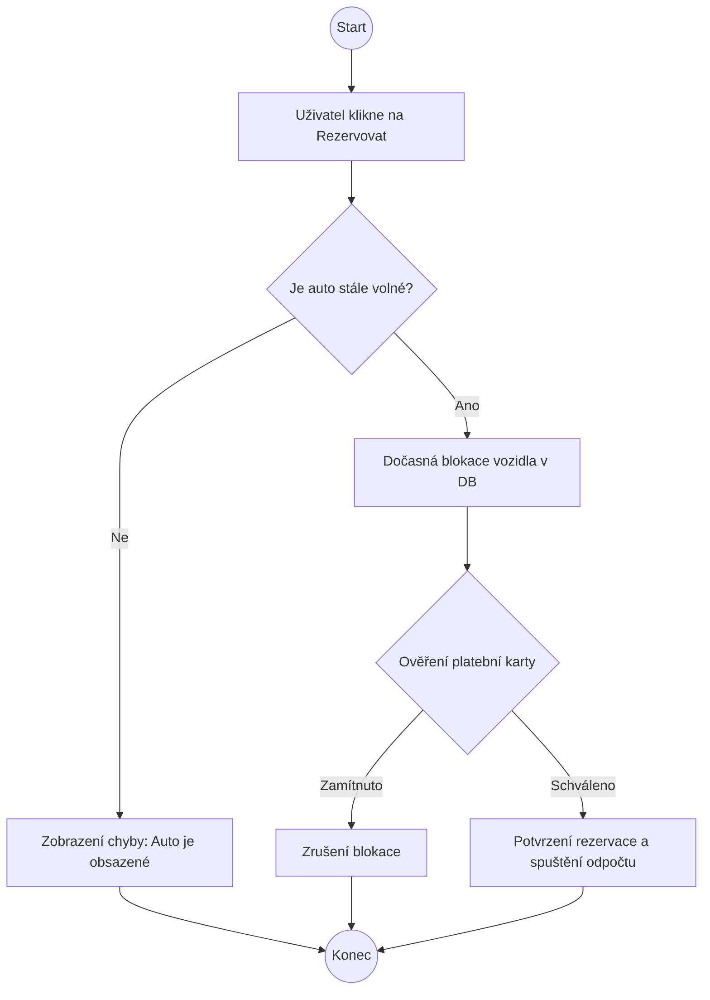
```mermaid
flowchart TD
    Start((Start)) --> Select[Uživatel klikne na Rezervovat]
    Select --> Check{Je auto stále volné?}
    Check -- Ne --> Error[Zobrazení chyby: Auto je obsazené]
    Check -- Ano --> Lock[Dočasná blokace vozidla v DB]
    Lock --> Pay{Ověření platební karty}
    Pay -- Zamítnuto --> Cancel[Zrušení blokace]
    Pay -- Schváleno --> Confirm[Potvrzení rezervace a spuštění odpočtu]
    Confirm --> End((Konec))
    Error --> End
    Cancel --> End
```

**UC Bežného uživatele 3: Zobrazit historii jízd**
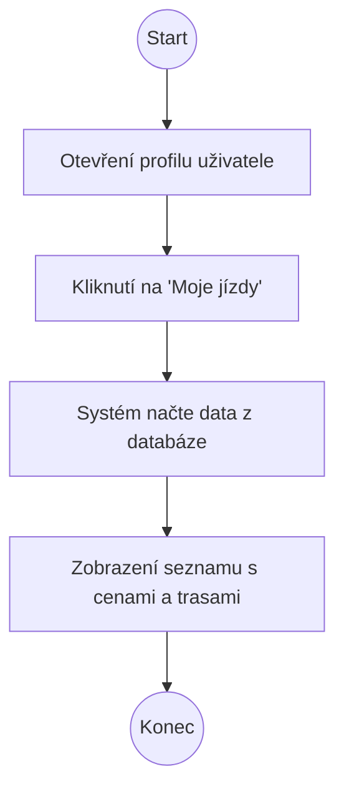
```mermaid
flowchart TD
    Start((Start)) --> Profile[Otevření profilu uživatele]
    Profile --> ClickHistory[Kliknutí na 'Moje jízdy']
    ClickHistory --> FetchDB[Systém načte data z databáze]
    FetchDB --> DisplayList[Zobrazení seznamu s cenami a trasami]
    DisplayList --> End((Konec))
```

### Role: Servisní technik

**UC Servisního technika 1: Zaevidovat nabití baterie**
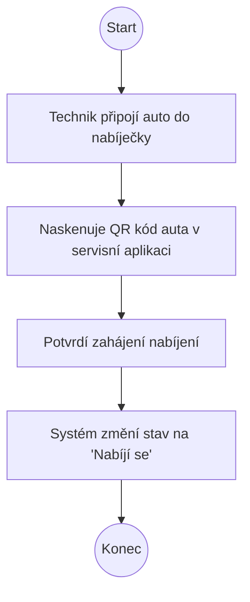
```mermaid
flowchart TD
    Start((Start)) --> Plug[Technik připojí auto do nabíječky]
    Plug --> Scan[Naskenuje QR kód auta v servisní aplikaci]
    Scan --> Confirm[Potvrdí zahájení nabíjení]
    Confirm --> UpdateStatus[Systém změní stav na 'Nabíjí se']
    UpdateStatus --> End((Konec))
```

**UC Servisního technika 2: Odebrat auto z mapy k servisu**
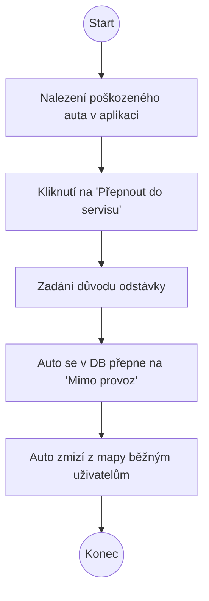
```mermaid
flowchart TD
    Start((Start)) --> FindCar[Nalezení poškozeného auta v aplikaci]
    FindCar --> ClickService[Kliknutí na 'Přepnout do servisu']
    ClickService --> Reason[Zadání důvodu odstávky]
    Reason --> UpdateDB[Auto se v DB přepne na 'Mimo provoz']
    UpdateDB --> Hide[Auto zmizí z mapy běžným uživatelům]
    Hide --> End((Konec))
```

**UC Servisního technika 3: Zobrazit vybitá a rozbitá auta**
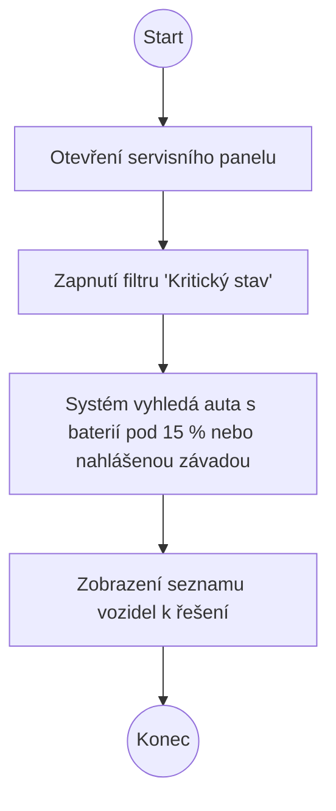
```mermaid
flowchart TD
    Start((Start)) --> OpenApp[Otevření servisního panelu]
    OpenApp --> Filter[Zapnutí filtru 'Kritický stav']
    Filter --> Query[Systém vyhledá auta s baterií pod 15 % nebo nahlášenou závadou]
    Query --> ShowList[Zobrazení seznamu vozidel k řešení]
    ShowList --> End((Konec))
```

### Role: Administrátor

**UC Administrátora 1: Zablokovat nebo odblokovat uživatele**
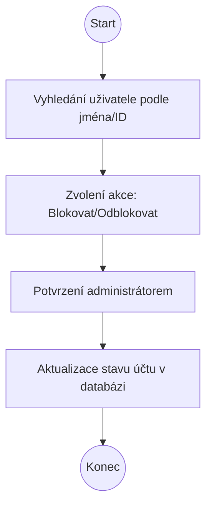
```mermaid
flowchart TD
    Start((Start)) --> SearchUser[Vyhledání uživatele podle jména/ID]
    SearchUser --> SelectAction[Zvolení akce: Blokovat/Odblokovat]
    SelectAction --> Confirm[Potvrzení administrátorem]
    Confirm --> UpdateAcc[Aktualizace stavu účtu v databázi]
    UpdateAcc --> End((Konec))
```

**UC Administrátora 2: Vyřešit reklamace a faktury**
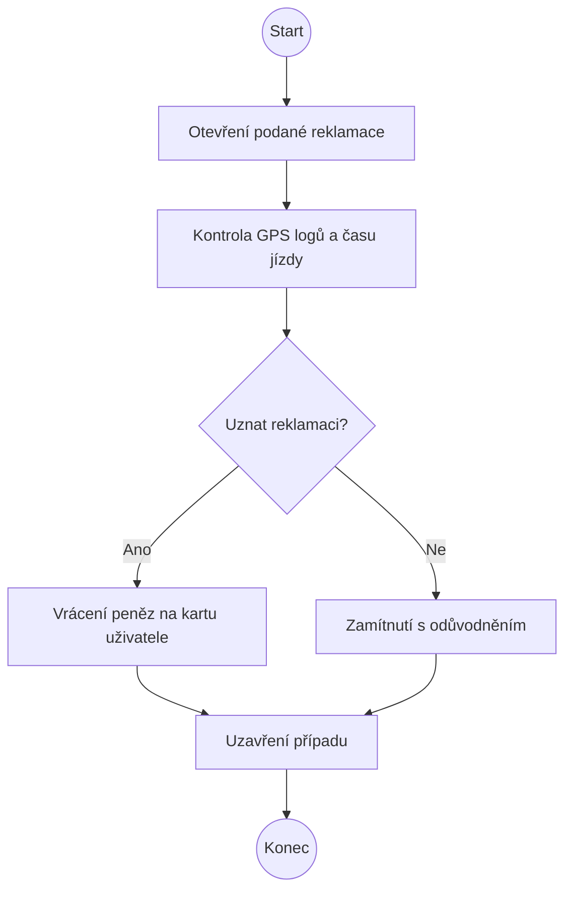
```mermaid
flowchart TD
    Start((Start)) --> OpenTicket[Otevření podané reklamace]
    OpenTicket --> CheckRide[Kontrola GPS logů a času jízdy]
    CheckRide --> Decision{Uznat reklamaci?}
    Decision -- Ne --> Reject[Zamítnutí s odůvodněním]
    Decision -- Ano --> Refund[Vrácení peněz na kartu uživatele]
    Refund --> CloseTicket[Uzavření případu]
    Reject --> CloseTicket
    CloseTicket --> End((Konec))
```

**UC Administrátora 3: Změnit cenu za minutu jízdy**
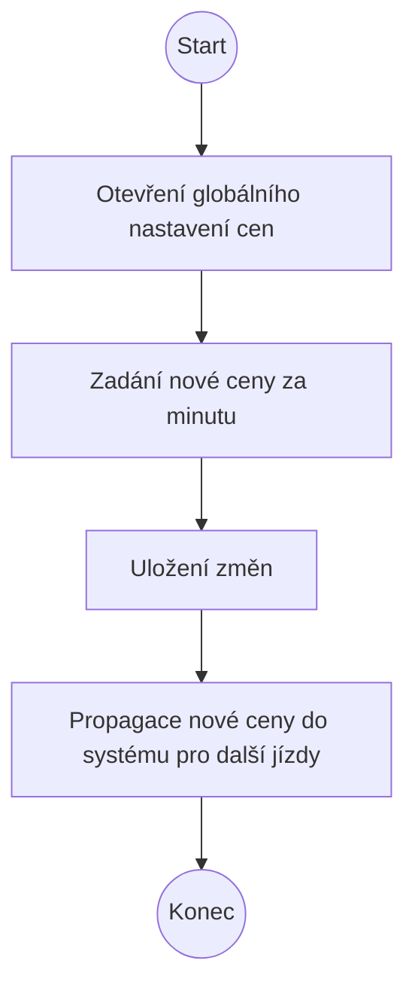
```mermaid
flowchart TD
    Start((Start)) --> OpenSettings[Otevření globálního nastavení cen]
    OpenSettings --> InputPrice[Zadání nové ceny za minutu]
    InputPrice --> Save[Uložení změn]
    Save --> UpdateSystem[Propagace nové ceny do systému pro další jízdy]
    UpdateSystem --> End((Konec))
```

### 1.3 Zdroje požadavků (Stakeholders)
Zde je popis našich zdrojů, které definují hodnotu jednotlivých požadavků v systému:
* **Zákazník:** Koncový řidič elektromobilu. Vyžaduje spolehlivost a rychlost klíčových funkcí (rezervace, odemčení).
* **Business:** Vedení firmy financující projekt. Definuje požadavky zajišťující ziskovost a stabilitu (fakturace, dostupnost).
* **Technik / Provoz:** Interní tým starající se o flotilu aut v terénu. Vyžaduje telemetrická data (baterie, servisní režim).
* **Architekt:** Hlavní softwarový návrhář. Definuje interní technické a mimofunkční požadavky (šifrování, robustnost).
* **Legislativa:** Právní rámec a státní nařízení. Diktuje povinné shody s předpisy (GDPR).
* **UX (User Experience):** Návrhář uživatelského rozhraní. Zaměřuje se na přívětivost systému (vizualizace na mapě).
* **Zadání:** Přímé a neměnné požadavky stanovené výchozím zadavatelem projektu.

## 1.4 Specifikace funkčních požadavků

| ID | Požadavek | Popis | Priorita | Zdroj | Rizika | Závislosti |
|:---|:---|:---|:---:|:---|:---|:---|
| **F01** | Rezervace vozidla | Uživatel si může zablokovat auto pro sebe skrze aplikaci. | High | Zákazník | Race condition (duplicitní rezervace) | F02 |
| **F02** | Sledování stavu | Systém eviduje stavy: volné, rezervované, v servisu. | High | Provoz | Nekoherentní data v databázi | - |
| **F03** | Správa uživatelů | Administrátor může měnit role a oprávnění uživatelů. | Medium | Zadání | Neoprávněné zvýšení privilegií | - |
| **F04** | Integrace map | Zobrazení polohy a dostupnosti aut na mapovém podkladu. | Medium | UX | Výpadek externí mapové služby (API) | F02 |
| **F05** | Fakturace jízdy | Automatický výpočet ceny a vystavení faktury po jízdě. | High | Business | Chyba ve výpočtu času/vzdálenosti | F06 |
| **F06** | Historie jízd | Uživatel má přístup k seznamu svých minulých výpůjček. | Low | Zákazník | Únik citlivých osobních údajů | - |
| **F07** | Stav baterie | Systém v reálném čase monitoruje a zobrazuje % nabití. | High | Technik | Zpoždění telemetrických dat z vozidla | - |
| **F08** | Ukončení jízdy | Bezpečné ukončení pronájmu a uzamčení vozidla. | High | Zákazník | Auto zůstane fyzicky odemčené | F01 |
| **F09** | Blokace neplatičů | Automatické zamezení rezervace při neuhrazených dluzích. | Medium | Fakturace | Chybná blokace platícího zákazníka | F05 |
| **F10** | Servisní režim | Možnost technika vyřadit vozidlo z nabídky pro veřejnost. | Medium | Technik | Nechtěné vyřazení funkčního vozu | F02 |

## 1.5 Specifikace mimofunkčních požadavků

| ID | Požadavek | Popis | Priorita | Zdroj | Rizika | Závislosti |
|:---|:---|:---|:---:|:---|:---|:---|
| **N01** | Bezpečná komunikace | Komunikace mezi aplikací a serverem probíhá výhradně přes šifrovaný protokol TLS. | High | Architekt | Odposlech citlivých dat (Man-in-the-middle) | - |
| **N02** | Dostupnost systému | Systém musí být dostupný v režimu 24/7 s garantovanou dostupností 99,9 % času. | Medium | Business | Ušlý zisk a nespokojenost lidí při výpadku | - |
| **N03** | Robustnost a zálohy | Odolnost proti HW chybám, při výpadku primárního serveru plynule přebírají provoz záložní servery. | Medium | Architekt | Krátkodobý výpadek při přepínání uzlů | - |
| **N04** | Ochrana osobních dat | Soulad s GDPR, citlivá data (hesla, platební údaje) jsou v DB šifrována. | High | Legislativa | Únik osobních údajů a právní postihy / pokuty | F03 |
| **N05** | Auditní logování | Veškeré změny stavů vozidla (rezervace, servis) jsou logovány s vazbou na ID uživatele. | Low | Provoz | Rychlé zaplnění diskového prostoru logy | F01, F10 |

## 1.6 Konfliktní požadavky a nejasnosti během analýzy

**1. Konflikt: Zobrazení historie jízd (F06) vs. Ochrana osobních dat / GDPR (N04)**
* **Identifikovaná nejasnost:** Systém musí pro uživatele a administrátory zaznamenávat přesnou trasu jízdy kvůli reklamacím. Dlouhodobé uchovávání přesných GPS bodů pohybu konkrétní osoby je však z hlediska ochrany soukromí a legislativy GDPR nepřípustné.
* **Navržené řešení:** Systém bude uchovávat detailní GPS trasu na mapě pouze po dobu 30 dnů od ukončení jízdy (kvůli vyřešení případných reklamací v rámci administrátorského bodu UC8). Poté se detailní souřadnice z databáze automaticky a nevratně smažou (anonymizují). V historii uživatele (F06) zůstane pouze agregovaný záznam: Datum, celkový čas, start, cíl, ujetá vzdálenost a výsledná cena.

**2. Konflikt: Správa rolí/Zvýšení privilegií (F03) vs. Bezpečnost a GDPR (N04)**
* **Identifikovaná nejasnost:** Existence administrátorské role s právem měnit oprávnění (F03) vytváří obrovské bezpečnostní riziko. Pokud by útočník (hacker) zneužil systém pro neoprávněné zvýšení svých privilegií (*Privilege Escalation*), získal by plný přístup k citlivým osobním údajům zákazníků, což by vedlo k okamžitému porušení GDPR (N04).
* **Navržené řešení:** Změna rolí a povyšování uživatelů na administrátory nebude možná běžným
