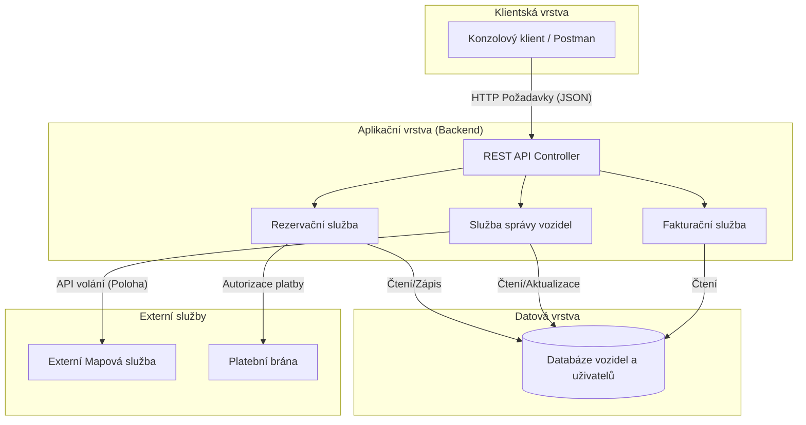

# 2. Softwarová architektura

## 2.1 Volba architektury a její zdůvodnění

Pro návrh systému správy sdílených elektromobilů jsem zvolila **Vrstvenou architektura (Layered Architecture)**.

**Zdůvodnění volby:**
1. **Oddělení odpovědností (Separation of Concerns):** Architektura jasně odděluje prezentační vrstvu (REST API / Konzole), vrstvu obchodní logiky (servisy) a datovou vrstvu (Databáze). To umožňuje nezávislý vývoj a snadnější testování jednotlivých komponent.
2. **Přiměřenost zadání:** Využití mikroslužeb by pro tento rozsah systému (a jeho částečnou implementaci) představovalo zbytečnou technologickou a síťovou režii (tzv. over-engineering). Monolitický přístup s vrstvami je efektivnější na nasazení i údržbu.
3. **Snadná evoluce:** Pokud by v budoucnu systém masivně narostl, lze jednotlivé dobře zapouzdřené vrstvy nebo moduly (např. Rezervační službu) poměrně snadno vyjmout a transformovat do samostatné mikroslužby.

## 2.2 Diagram komponent a interakcí
Následující diagram znázorňuje hlavní komponenty systému a toky dat mezi nimi. Zahrnuje komunikaci od uživatelského rozhraní přes API až po databázi a externí služby.

## 2.3 Popis klíčových komponent

* **REST API Controller:** Vstupní brána do systému. Přijímá HTTP požadavky od klientů, provádí základní validaci vstupů a směruje je na příslušné služby.
* **Rezervační služba:** Obsahuje hlavní obchodní logiku pro vytváření, ověřování a rušení rezervací. Řeší kolize (aby si dvě osoby nerezervovaly stejné auto).
* **Služba správy vozidel:** Spravuje stavy aut (volné, nabité, v servisu). Integruje se s externí mapovou službou pro získání GPS souřadnic.
* **Fakturační služba:** Po ukončení jízdy vypočítá finální cenu na základě času a případně ujeté vzdálenosti.
* **Databáze:** Pro účely minimální implementace je navržena jako In-Memory úložiště (slovníky/seznamy v paměti), v produkci by byla nahrazena relační databází (např. PostgreSQL).
