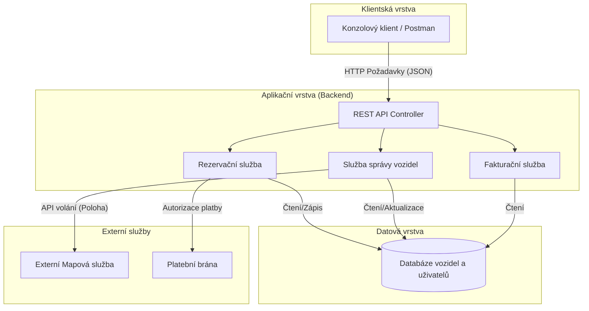

# 2. Softwarová architektura

## 2.1 Volba architektury a její zdůvodnění

Pro návrh systému správy sdílených elektromobilů jsem zvolila **Vrstvenou architekturu (Layered Architecture)**.

**Zdůvodnění volby:**
1. **Oddělení vrstev a testovatelnost:** Architektura logicky rozděluje aplikaci na API, logiku a databázi. Díky tomu se kód dobře udržuje a samotná logika se dá jednoduše otestovat pomocí testovacích dvojníků, aniž bych musela spouštět reálnou databázi.
2. **Přiměřenost k zadání:** Dělat to rovnou přes mikroslužby by bylo pro tento projekt zbytečně složité. Layered infrastructure se mnohem snadněji nasazuje i spravuje a navíc mám díky tomu možnost využít test doubles.
3. **Snadné úpravy do budoucna:** Kdyby systém časem vyrostl, dají se díky rozdělení jednotlivé služby docela snadno odebrat a předělat na samostatné mikroslužby. Půjde to vyřešit běžným refactoringem a nebude nutné přepisovat celou aplikaci úplně od začátku.

## 2.2 Diagram komponent a interakcí
Následující diagram znázorňuje hlavní komponenty systému a toky dat mezi nimi. Zahrnuje komunikaci od uživatelského rozhraní přes API až po databázi a externí služby.

```mermaid
graph TD
    subgraph "Klientská vrstva"
        CLI[Konzolový klient / Postman]
    end

    subgraph "Aplikační vrstva (Backend)"
        API[REST API Controller]
        RES[Rezervační služba]
        CAR[Služba správy vozidel]
        BILL[Fakturační služba]
    end

    subgraph "Datová vrstva"
        DB[(Databáze vozidel a uživatelů)]
    end

    subgraph "Externí služby"
        MAP[Externí Mapová služba]
        PAY[Platební brána]
    end

    %% Propojení vrstev
    CLI -- "HTTP Požadavky (JSON)" --> API
    API --> RES
    API --> CAR
    API --> BILL

    RES -- "Čtení/Zápis" --> DB
    CAR -- "Čtení/Aktualizace" --> DB
    BILL -- "Čtení" --> DB

    %% Integrace externích služeb
    CAR -- "API volání (Poloha)" --> MAP
    RES -- "Autorizace platby" --> PAY
```

## 2.3 Popis klíčových komponent

* **REST API Controller:** Vstupní brána do systému. Přijímá HTTP požadavky od klientů, provádí základní validaci vstupů a směruje je dál na příslušné služby.
* **Rezervační služba:** Obsahuje hlavní logiku pro vytváření, ověřování a rušení rezervací. Hlídá byznys pravidla a řeší kolize, aby si dva lidé nemohli zarezervovat stejné auto ve stejný moment.
* **Služba správy vozidel:** Eviduje a mění stavy aut (volné, rezervované, v servisu). Komunikuje s mapovou službou pro získání a aktualizaci GPS souřadnic vozidel.
* **Fakturační služba:** Po úspěšném ukončení jízdy vypočítá výslednou cenu na základě času jízdy a ujeté vzdálenosti.
* **Databáze:** Data jsou uložena přímo v paměti programu pomocí Python slovníku (`db_cars`). Tento slovník v našem kódu simuluje datové úložiště vozidel a jejich stavů. V testování toto řešení funguje jako testovací dvojník typu **Fake**. V ostré produkci by se tento slovník nahradil klasickou databází (např. PostgreSQL).
