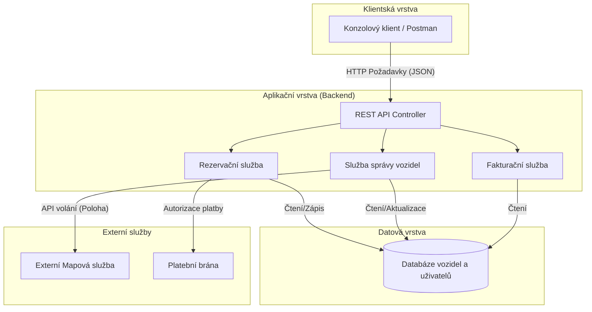

# 2. Softwarová architektura

## 2.1 Volba architektury a její zdůvodnění

Pro návrh systému správy sdílených elektromobilů jsem zvolila **Vrstvenou architekturu (Layered Architecture)**.

**Zdůvodnění volby:**
1. **Oddělení odpovědností a extrémní testovatelnost:** Architektura striktně odděluje prezentační vrstvu (REST API), vrstvu byznys logiky (Služby) a datovou vrstvu (Databáze a integrace s API). Toto izolování vrstev mi umožňuje **vysokou úroveň interní kvality** – byznys logiku rezervační služby lze díky tomu snadno testovat pomocí Unit a Integračních testů, aniž bych musela spouštět celou databázi, protože závislosti mohu nahradit tzv. Testovacími dvojníky (*Test Doubles*).
2. **Přiměřenost zadání:** Využití mikroslužeb by pro tento rozsah systému představovalo zbytečnou technologickou a síťovou režii (tzv. over-engineering). Monolitický přístup s vrstvami je efektivnější na nasazení i údržbu a zároveň systém udržuje v kvadrantu "vysoká kvalita kódů".
3. **Snadná evoluce (Refactoring):** Pokud by v budoucnu systém narostl, lze díky čistému rozhraní jednotlivé moduly (např. Rezervační službu) poměrně snadno vyjmout a transformovat do samostatné mikroslužby. Architektura tedy umožňuje plynulý refactoring místo drahého přepisování (reengineeringu).

## 2.2 Diagram komponent a interakcí
Následující diagram znázorňuje hlavní komponenty systému a toky dat mezi nimi. Zahrnuje komunikaci od uživatelského rozhraní přes API až po databázi a externí služby.

```mermaid
graph TD
    subgraph "Klientská vrstva"
        CLI[Konzolový klient / Postman]
    end

    subgraph "Aplikační vrstva (Backend)"
        API[REST API Controller]
        RES[Rezervační služba]
        CAR[Služba správy vozidel]
        BILL[Fakturační služba]
    end

    subgraph "Datová vrstva"
        DB[(Databáze vozidel a uživatelů)]
    end

    subgraph "Externí služby"
        MAP[Externí Mapová služba]
        PAY[Platební brána]
    end

    %% Propojení vrstev
    CLI -- "HTTP Požadavky (JSON)" --> API
    API --> RES
    API --> CAR
    API --> BILL

    RES -- "Čtení/Zápis" --> DB
    CAR -- "Čtení/Aktualizace" --> DB
    BILL -- "Čtení" --> DB

    %% Integrace externích služeb
    CAR -- "API volání (Poloha)" --> MAP
    RES -- "Autorizace platby" --> PAY
```

## 2.3 Popis klíčových komponent

* **REST API Controller:** Vstupní brána do systému. Přijímá HTTP požadavky od klientů, provádí základní validaci vstupů a směruje je na příslušné služby.
* **Rezervační služba:** Obsahuje hlavní obchodní logiku pro vytváření, ověřování a rušení rezervací. Řeší kolize (aby si dvě osoby nerezervovaly stejné auto).
* **Služba správy vozidel:** Spravuje stavy aut (volné, nabité, v servisu). Integruje se s externí mapovou službou pro získání GPS souřadnic.
* **Fakturační služba:** Po ukončení jízdy vypočítá finální cenu na základě času a případně ujeté vzdálenosti.
* **Databáze:** Pro účely minimální implementace je navržena jako In-Memory úložiště (slovníky/seznamy v paměti), v produkci by byla nahrazena relační databází (např. PostgreSQL).
